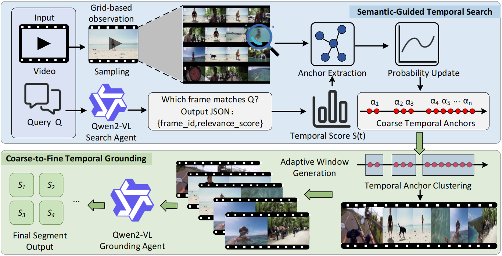

# C2F-TG: Semantic-Guided Coarse-to-Fine MLLMs for Video Reasoning


Official implementation of **C2F-TG**, a semantic-guided coarse-to-fine framework for video reasoning and temporal grounding with multimodal large language models.

> **C2F-TG: Semantic-Guided Coarse-to-Fine MLLMs for Video Reasoning**
> Jun Yang, Haijiang Li, Jisheng Dang, Wencan Zhang, Peng Zhou, Bimei Wang, Hong Peng, Wei-Shi Zheng, Qi Tian, Tat-Seng Chua

## 🖼️ Framework Figure

```text
assets/framework.png
```

## 🔍 Overview

C2F-TG aims to localize query-relevant temporal evidence in videos for reliable video reasoning.

Instead of directly grounding a query over the full video, C2F-TG follows a **coarse-to-fine** pipeline:

1. **Semantic-Guided Temporal Search**
   The video is sampled into indexed image-grid observations. A multimodal search agent scores query-relevant frames and builds a temporal relevance distribution.

2. **Anchor-Guided Localized Grounding**
   High-response timestamps are extracted as coarse temporal anchors, clustered into candidate windows, and refined by a grounding agent to obtain the final temporal segment.

## 🧩 Framework

<p align="center">
  
</p>

<p align="center">
  <b>Figure:</b> Overall framework of C2F-TG.
</p>

```text
Input Video + Query
        ↓
Indexed Image-Grid Observation
        ↓
Semantic-Guided Temporal Search
        ↓
Coarse Temporal Anchors
        ↓
Adaptive Candidate Windows
        ↓
Localized Grounding
        ↓
Final Temporal Segment
```

## ✨ Highlights

* Semantic-guided temporal search for video reasoning
* Indexed image-grid observation for efficient video understanding
* Coarse temporal anchor extraction from relevance distribution


## ⚙️ Installation

```bash
git clone https://github.com/LLeehha/C2F-TG.git
cd C2F-TG

conda create -n c2ftg python=3.10 -y
conda activate c2ftg
```

Please install the required dependencies according to your local environment and model setting.

## 🚀 Quick Start

Modify the video path and query in the example script:

```python
video_path = "path/to/video.mp4"
query = "When is the man swimming?"
```

Then run:

```bash
python example_complete_pipeline.py
```

The example pipeline includes:

```text
1. Semantic-guided temporal search
2. Temporal anchor extraction
3. Adaptive candidate window generation
4. Localized grounding and final prediction
```

## 📊 Main Results

C2F-TG improves temporal grounding performance over the direct VideoMind baseline under the same 2B model scale.

| Dataset      | VideoMind mIoU | C2F-TG mIoU |
| ------------ | -------------: | ----------: |
| NExT-GQA     |           28.6 |        29.1 |
| ReXTime      |          24.83 |       27.30 |
| Charades-STA |           45.2 |        45.6 |
| TACoS        |           27.4 |        28.9 |
| Ego4D-NLQ    |            4.7 |         5.4 |

## 📁 Repository Structure

```text
C2F-TG/
├── README.md
├── assets/
│   └── framework.png
├── example_complete_pipeline.py
├── interface_searcher.py
├── qwen_searcher.py
└── utilites.py
```


## 📝 Paper Status

The paper is currently under review. Citation information will be updated after acceptance.

## 🙏 Acknowledgements

This work builds on recent progress in multimodal large language models, video reasoning, and temporal grounding.

## 📄 License

This project is released for academic research purposes.
